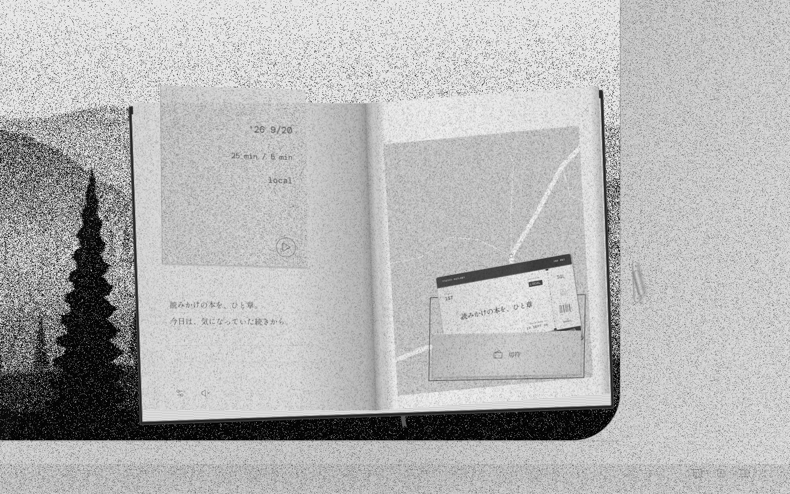
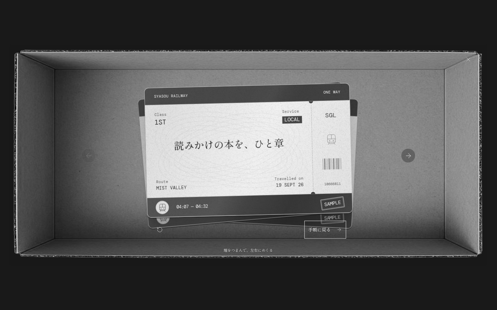

# 車窓 — SYASOU

**今日のひと区切りを、列車の旅に。**

『車窓』は、列車の窓辺で読書や作業をしながら、旅の切符を集める小さなブラウザゲームです。流れる山並み、静かな走行音、書き込みのできる手帳。席に着いたら、今日やりたいことをひとつ持ち込んでください。

**[ブラウザで遊ぶ](https://syasou.vercel.app)** · [切符入りのお試しプレイ](https://syasou.vercel.app/?demo=1)


## 窓の向こうを眺める

霧の山あい、広い雪原、遠くを走る列車。三つの眺めを、その日の気分で選べます。窓をクリックすると、景色を近くで眺める視点へ。ときどき顔を上げて、通り過ぎる木々を見送るのも旅のうちです。

列車の走行音に、雨や風の音を重ねることもできます。窓脇の金具を開ければ、風の聞こえ方も変わります。各駅・準急・特急から、心地よい速さを選んでください。

## 手帳を開いて、出発する

本をひと章読む。続きを少し書く。気になっていたことを、手帳に書き出す。

作業時間を決めて再生ボタンを押すと、手帳が閉じて列車が走り始めます。15・25・45・60・90 分から選べるほか、時間を決めずに乗ることもできます。時計は手帳の中にあるので、閉じている間は窓辺の景色を楽しめます。

ひと区切りついたら、列車を止めて休憩。次の旅は、自分のタイミングで出発できます。

## 旅の記録は、一枚の切符に

作業時間が終わるか、自分で「旅を終える」と、紙の箱に切符が届きます。表には作業の名前や日付、その旅の景色。裏には、手帳に書いたメモが残ります。

切符の端をつまんで、左右にめくる。裏にひとこと書き足す。手帳のポケットから、前の旅を読み返す。集まるのは、あなたが過ごした時間の記録です。

<p>
  
  
</p>

*画面はお試しプレイのサンプル切符を使って撮影しています。*

## はじめての乗車

1. **「窓辺へ」から席に着く。** 初回の「旅のしおり」で、手帳と車窓の使い方を案内します。最後には、はじめての記念切符が届きます。
2. **手帳を開いて、やりたいことを書く。** 時間や音を好みに合わせ、再生ボタンで出発します。
3. **読書や作業を、自分のペースで。** 途中で休みたいときは、手帳から一時停止できます。
4. **届いた切符を、手帳にしまう。** ひと息ついたら、また次の旅へ。

切符を先に触ってみたい方は、[お試しプレイ](https://syasou.vercel.app/?demo=1)へ。三枚のサンプル切符が入った手帳を用意しています。通常プレイとは別の場所に記録されます。

## 遊べる環境とセーブ

PC・スマートフォンの新しいブラウザで遊べます。マウスやタッチに加え、キーボードでも操作できます。スマートフォンの「ホーム画面に追加」にも対応しています。

ログインは不要です。設定、メモ、進行中の旅、切符は、使っているブラウザに自動保存されます。再読み込みしても旅を引き継ぎ、離れている間に到着していた場合は、戻ったときに切符を受け取れます。

起動・再読み込みにはインターネット接続が必要です。記録の端末間同期はなく、ブラウザの保存データを消すと記録も消えます。通常のブラウザとホーム画面のアプリでは、保存場所が異なる場合があります。再読み込み後の音は、手帳から再生してください。

## 開発について

画面・操作・旅と切符のロジック・保存・WebGL 描画・音声合成に加え、起動とエラー復帰も MoonBit で実装しています。画面更新・状態管理・spring も MoonBit で実装し、ダイアログにはブラウザ標準 API を使っています。React は使っていません。アプリ本体は WebAssembly、起動部分は MoonBit から生成した JS とし、ブラウザ API の接続コードとともに Vercel から静的配信します。リポジトリ全体の移行状況は [MoonBit 化の範囲](docs/moonbit-coverage.md)にまとめています。

ローカルで起動するには、Node.js 22.12 以降で次を実行してください。

```sh
npm ci
npm run dev
```

[開発ガイド](docs/development.md) · [回帰テスト](tests/fixtures/README.md) · [バインディングの contribution 候補](docs/upstream-bindings.md)
